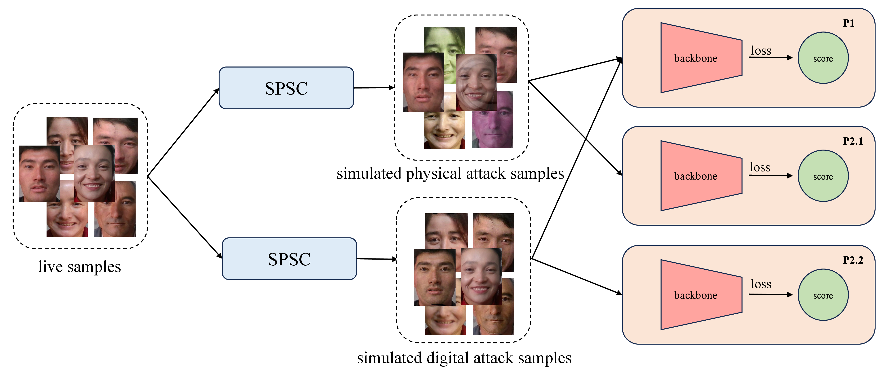

# Joint Physical-Digital Facial Attack Detection Via Simulating Spoofing Clues [CVPR2024 Workshop]
This repository is the official implementation of [Joint Physical-Digital Facial Attack Detection Via Simulating Spoofing Clues](http://arxiv.org/abs/2404.08450)
# 🤗 Overview our method
The overview pipeline of our method. We propose Simulated Physical Spoofing Clues augmentation (SPSC), which augments live samples into simulated physical attack samples for training within protocols 1 and 2.1. Concurrently, we present Simulated Digital Spoofing Clues augmentation (SDSC), converting live samples into simulated digital attack samples, tailored for training under protocols 1 and 2.2.



1. employ ColorJitter to simulate the spoofing clues of print attacks
2. use moire pattern augmentation to simulate the spoofing clues of replay attacks
3. SPSC consists of ColorJitter and moire pattern augmentation
4. introduce SPSC to simulate the spoofing clues of digital forgery
5. attempt to use GaussNoise or gradient-based noise to simulate the spoofing clues of adversarial attacks, but do not work

# 🏃‍♂️ Getting Started

## Data Format
Please make a copy of the original data and place it in the following format：
1. copy data and get txt files
```bash 
cp -r xxx/phase1/* cvpr2024/data/
cp -r xxx/phase2/* cvpr2024/data/
cd cvpr2024/data
cat p1/dev.txt p1/test.txt > p1/dev_test.txt
cat p2.1/dev.txt p2.1/test.txt > p2.1/dev_test.txt
cat p2.2/dev.txt p2.2/test.txt > p2.2/dev_test.txt
```
2. get train_dev_label.txt
```bash 
python data_preprocess/merge_dev_train_data.py # please modify the base path
# p1: merge all dev data to train
# p2.1: only merge dev live data to train
# p2.2: only merge dev live data to train
```
3. final data format:
```bash
base_path = "xxx/cvpr2024"

|----cvpr2024/data
  |----p1
    |----train
    |----dev
    |----test
    |----train_live_mask
    |----train_label.txt
    |----dev_label.txt
    |----train_dev_label.txt
    |----dev_test.txt
  |----p2.1
    |----train
    |----dev
    |----test
    |----train_live_mask
    |----train_label.txt
    |----dev_label.txt
    |----train_dev_label.txt
    |----dev_test.txt
  |----p2.2
    |----train
    |----dev
    |----test
    |----train_live_mask
    |----train_label.txt
    |----dev_label.txt
    |----train_dev_label.txt
    |----dev_test.txt
```

## ⚒️ Installation
```bash
pip install -r requirements.txt
```

## Data Preprocess
#### Detect face
if image width >= 700 and image height >= 700, we will detect face from the image and expand 20 pixel crop face from the image.
If no face is detected in the image, we will center crop a 500*500 bbox from the image which implements this logic in dataset.py where the training data is loaded.
we need pip install insightface and use insightface to detect face.It will download the model by default to detect faces. 
<br>
Please modify the base path and run detect_face.py.The crop_face will overwrite the original image.
```bash
cd data_preprocess
python detect_face.py
```
#### Generate train.txt live sample's mask
[face-parsing github](https://github.com/zllrunning/face-parsing.PyTorch) <br>
download face-parsing model from [79999_iter.pth](https://drive.google.com/file/d/154JgKpzCPW82qINcVieuPH3fZ2e0P812/view) <br>
Please modify root_dir and model_path.
```bash
cd data_preprocess/face_parsing
bash generate_mask.sh
```
## Imagenet pretrain model
download pretrain model: [resnet50](https://download.pytorch.org/models/resnet50-19c8e357.pth)

## Training resources
- Please use 1*A100(80G) for training, only modify the dataset base path, do not modify other parameters in training.
- We fixed the random seed to ensure reproducible results. Modifying other training parameters will cause fluctuations in the final results.
- Training only takes 1 hour for each protocol. 
- Inference only takes 1 minute for each protocol.

## 🚀  P1 Train and Test
Train p1 protocol:
```bash
bash scripts/train_p1.sh
```
Test: select the 200th epoch model weight
```bash
bash scripts/test_p1.sh
```
## 🚀  P2.1 Train and Test
Train p2.1 protocol:
```bash
bash scripts/train_p21.sh
```
Test: select the 200th epoch model weight
```bash
bash scripts/test_p21.sh
```

## 🚀  P2.2 Train and Test
Train p2.2 protocol:
```bash
bash scripts/train_p22.sh
```
Test: select the 200th epoch model weight
```bash
bash scripts/test_p22.sh
```

## 🚀  Testing in general scenarios 
**spoof=1, live=0** <br>
If you want to test data in any scenario, we provide some low-profile models trained on our own datasets. It is recommended to input the full image area for [full_resnet50.pth](https://drive.google.com/file/d/1VpWN8CXdVVLTwyTPABeFXmr3UnnenjYe/view?usp=sharing) and [full_swin_v2_base.pth](https://drive.google.com/file/d/1Ii3JmoRjWcOLF4xNwCqtJyp0Ok0vJva3/view?usp=sharing). Meanwhile, we provide the model [face_swin_v2_base.pth](https://drive.google.com/file/d/1E4UD8UK_KzjhpAvR6hYInlteOEaxDZbZ/view?usp=sharing) model of the face region.:

```bash
bash scripts/test.sh
```

## 🏆 Our models (only for Competition Dataset)

Protocol|APCER(%)|BPCER(%)|ACER(%)|model
:---:|:---:|:---:|:---:|:---:
P1|0.31|0.09|0.20|[p1_resnet50.pth](https://drive.google.com/file/d/1gNUMzaK87CcQlM_aCr7TjU3iLx_2NiBp/view?usp=drive_link)
P2.1|2.55|0.09|1.32|[p21_resnet50.pth](https://drive.google.com/file/d/1pTxdI2uZj1yBSCN64vKs-cQddIZN6rvO/view?usp=drive_link)
P2.2|1.73|1.58|1.65|[p22_resnet50.pth](https://drive.google.com/file/d/1GTAoTmyCbYGws5BV07qUL-iGVvHx_LmF/view?usp=sharing)

## 🏆 Our models for General Scenarios

input|model
:---:|:---:
full image|[full_resnet50.pth](https://drive.google.com/file/d/1VpWN8CXdVVLTwyTPABeFXmr3UnnenjYe/view?usp=sharing)
full image|[full_swin_v2_base.pth](https://drive.google.com/file/d/1Ii3JmoRjWcOLF4xNwCqtJyp0Ok0vJva3/view?usp=sharing)
face area|[face_swin_v2_base.pth](https://drive.google.com/file/d/1E4UD8UK_KzjhpAvR6hYInlteOEaxDZbZ/view?usp=sharing)
full image|[mobilenet_v3_small.pth](https://drive.google.com/file/d/1UhCrC2VQCz4zE1UFc-lnziivqB3bSIpP/view?usp=sharing)
full image|[shufflenetv2_1.0x.pth](https://drive.google.com/file/d/18e23EW2ncsnOqET4jCSEskHVNvFYAF1j/view?usp=sharing)
full image|[shufflenetv2_0.5x.pth](https://drive.google.com/file/d/16VzZSYcVTNErFoLF87urdrzQbGbKvqjX/view?usp=sharing)

## 🎓 Citation
If you find this repository useful for your research, please use the following entry.
```BibTeX
@inproceedings{he2024joint,
  title={Joint Physical-Digital Facial Attack Detection Via Simulating Spoofing Clues},
  author={He, Xianhua and Liang, Dashuang and Yang, Song and Hao, Zhanlong and Ma, Hui and Mao, Binjie and Li, Xi and Wang, Yao and Yan, Pengfei and Liu, Ajian},
  booktitle={Proceedings of the IEEE/CVF Conference on Computer Vision and Pattern Recognition},
  pages={995--1004},
  year={2024}
}
```
